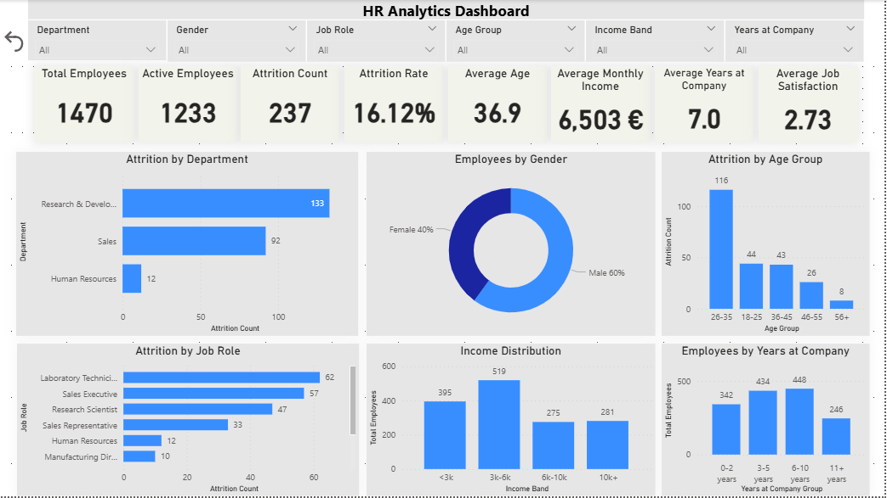
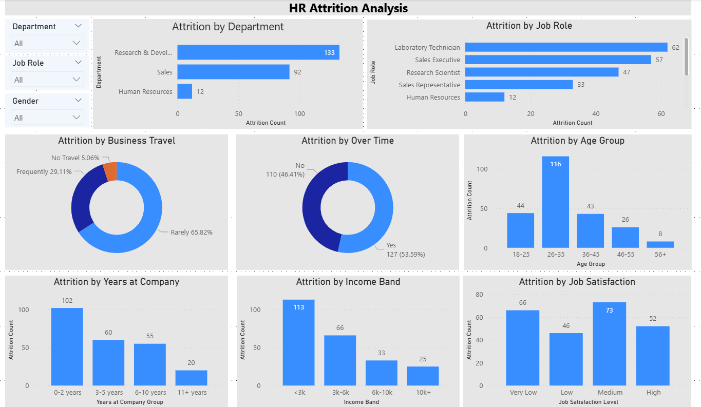
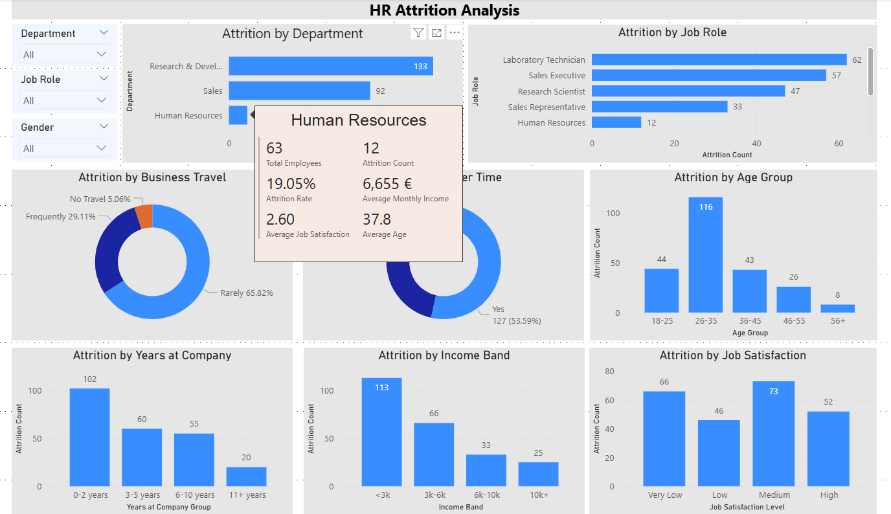

# HR Analytics Dashboard

Interactive HR Analytics dashboard built in Microsoft Power BI.

---

## Business Problem

Human Resources departments need to understand employee turnover and identify the main factors contributing to attrition.

This dashboard provides HR managers with an interactive overview of employee demographics, attrition trends, job satisfaction, salary distribution, and workforce composition.

---

## Objectives

- Monitor employee attrition
- Identify high-risk departments
- Analyze employee demographics
- Evaluate salary distribution
- Compare job satisfaction across employee groups
- Support HR decision-making

---

## Dataset

IBM HR Analytics Employee Attrition & Performance Dataset

Records:
1470 employees

Source:
IBM Sample Dataset

---

## Data Model

Single-table model enhanced with calculated columns.

Additional columns created:

- Age Group
- Income Band
- Years at Company Group
- Job Satisfaction Level
- Business Travel Category

Sorting columns created for proper visual ordering.

---

## DAX Measures

- Total Employees
- Active Employees
- Attrition Count
- Attrition Rate
- Average Age
- Average Monthly Income
- Average Years at Company
- Average Job Satisfaction

---

## Dashboard Pages

### Executive Dashboard

- KPI Cards
- Employee Distribution
- Attrition by Department
- Attrition by Age
- Income Distribution
- Employee Composition

---

### HR Attrition Analysis

Interactive analysis including

- Department
- Job Role
- Business Travel
- Overtime
- Job Satisfaction
- Income Band
- Years at Company

Includes report tooltips.

---

## Key Insights

- Overall Attrition Rate: 16.12%
- Research & Development has the highest employee turnover.
- Employees aged 26–35 represent the largest attrition group.
- Employees with lower salaries show higher attrition.
- Overtime employees leave significantly more often.
- Job Satisfaction has a measurable relationship with employee turnover.

---

## Tools

- Microsoft Power BI
- Power Query
- DAX

---

## Screenshots

Executive Dashboard

Attrition Analysis

Interactive Tooltip

