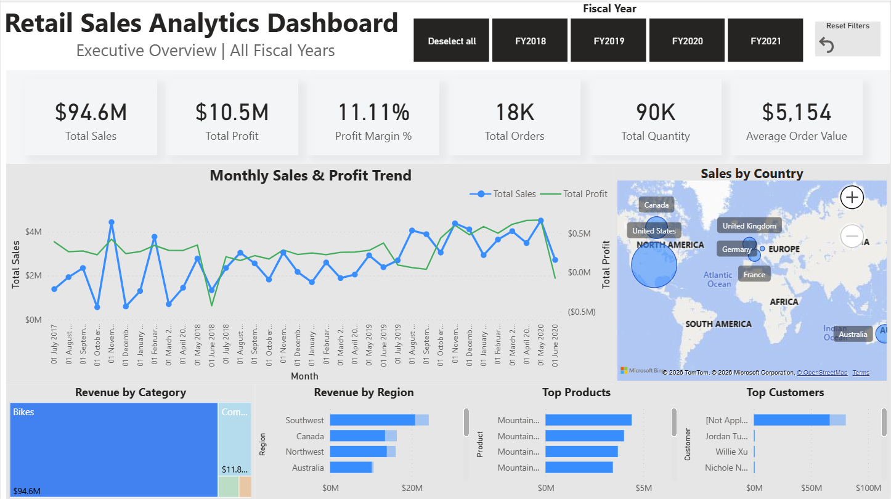
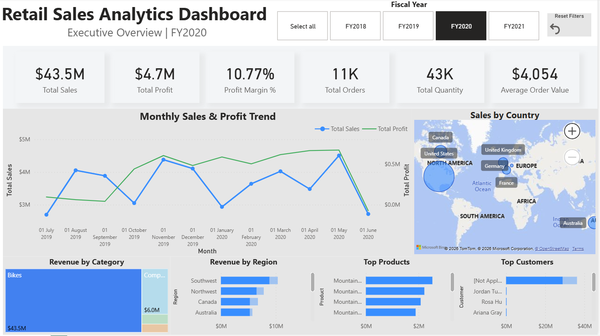
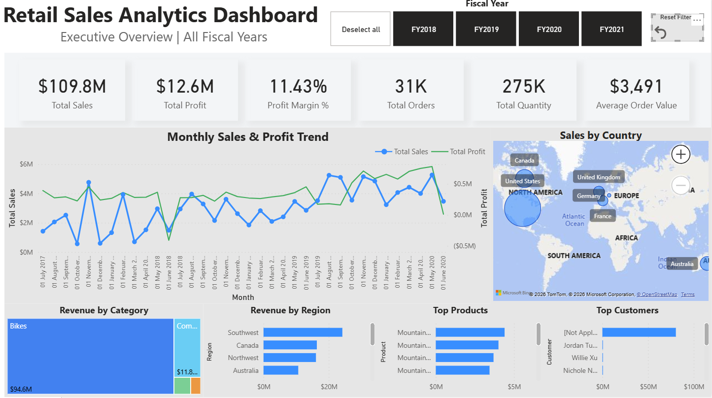

# Retail Sales Analytics Dashboard

## Overview

This project demonstrates the development of an interactive executive dashboard in Power BI using the AdventureWorks dataset.

The dashboard provides business stakeholders with a high-level overview of sales performance, profitability, customer activity, and regional trends.

---

## Business Problem

Business managers need a single dashboard to answer the following questions:

- How are sales changing over time?
- Which regions generate the highest revenue?
- Which products perform best?
- Who are the most valuable customers?
- How profitable is the business?

The goal was to create a clean executive dashboard for fast decision-making.

---

## Dataset

AdventureWorks Sales Dataset

Main tables:

- Sales
- Customer
- Product
- Sales Territory
- Date
- Sales Order
- Reseller

---

## Data Model

Star Schema

Fact table:

- Sales

Dimension tables:

- Date
- Customer
- Product
- Sales Territory
- Sales Order
- Reseller

---

## Power Query

Data preparation included:

- Removing unnecessary columns
- Correct data types
- Relationship validation
- Data cleaning

---

## DAX Measures

Main KPIs:

- Total Sales
- Total Profit
- Total Cost
- Profit Margin %
- Total Orders
- Total Quantity
- Average Order Value

Additional calculations:

- Dynamic filtering
- Executive Title
- Sales Trend

---

## Dashboard Features

- Executive KPI cards
- Fiscal Year slicer
- Monthly Sales & Profit Trend
- Sales by Country
- Revenue by Category
- Revenue by Region
- Top Products
- Top Customers
- Interactive tooltips
- Reset Filters button

---

## Key Insights

- The United States is the largest sales market.
- Bikes generate the majority of total revenue.
- Profitability remains stable across most fiscal years.
- Sales increase significantly during several seasonal periods.

---

## Tools

- Power BI Desktop
- Power Query
- DAX
- AdventureWorks Dataset

---

## Screenshots

### Executive Overview

---

### FY2020 Filter

---

### Interactive Tooltip

---

## Author

Sergey Cvetkov

Data Analytics Portfolio
